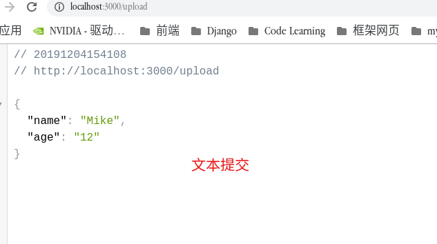

# Koa Learn

---

## 0. Koa 概述

**参考**：

[koa2 设计模式-学习笔记](https://github.com/chenshenhai/koajs-design-note)

[koa 官网](https://koa.bootcss.com/#)

[koa2 进阶学习笔记](https://chenshenhai.github.io/koa2-note/)

**Koa2 实现的功能**：

- HTTP 服务
  - 处理 HTTP 请求 request
  - 发送 HTTP 响应 response
- 中间件执行
  - 中间件加载
  - 中间件执行

**代码GitHub地址：**[github地址](https://github.com/LaoChen1994/KoaLearn)

## 1. 安装 Koa 环境

```bash
npm i koa -s
```

## 2. Koa 的中间件

### 1. 中间件的加载

**加载方法**(app.use):

```javascript
// my-koa-app.js
const Koa = require('koa');
const app = new Koa();

// 利用app.use来添加级联调用的中间件
app.use(async ctx => {
  ctx.body = 'Hello World!';
});

app.listen(3000, () => {
  console.log('App Server listen 3000');
});
```

### 2. Koa 中间件级联调用

**级联调用**(利用 await 调用，等待下一个中间件的执行过程)

```javascript
// my-koa-app.js
const Koa = require('koa');
const app = new Koa();

app.use(async (ctx, next) => {
  // 当执行到这个await会直接跳到下一个中间件进行执行
  await next();
  const rt = ctx.response.get('X-Response-Time');
  console.log(`${ctx.method} ${ctx.url} ${rt}`);
});

app.use(async (ctx, next) => {
  const start = Date.now();
  await next();
  const ms = Date.now() - start;
  console.log('set time ');
  ctx.set('X-Response-Time', `${ms}ms`);
});

app.use(async ctx => {
  ctx.body = 'Hello World!';
  console.log('body');
});

app.listen(3000, () => {
  console.log('App Server listen 3000');
});
```

### 3. 中间件的编写和调用

- 利用 async / await 编写 koa 中间件
  - async 异步调用
  - 需要执行的函数体
  - await next()执行完后通过 next 等待后序级联中间件的运行

```javascript
// my-koa-app.js
function logger(ctx, next) {
  console.log('*****************');
  console.log(ctx.method, ctx.header.host, ctx.url);
  console.log('*****************');
  await next();
}

module.exports = {
  logger
}
```

- 调用方法: 导入用 app.use 调用即可

```javascript
const { logger } = require('./middleware/logger.js');
app.use(logger());
```

## 3. 路由

### 1. 简单的页面路由

**思路**:

+ 解析请求的url获得请求页面路径
+ 根据不同的页面路径获得不同的渲染页面模板
+ 将模板内容传给ctx.body

~~~javascript
// my-koa-router.js
const Koa = require('koa');
const app = new Koa();
const { handleRouter } = require('./middleware/router.js');

// 将处理路由函数进行封装成一个中间件
app.use(handleRouter);

app.listen(5000, () => {
  console.log('start at port 5000');
});
~~~

~~~javascript
// router.js
const readFile = path =>
  new Promise((resolve, reject) =>
　　//　这里读的文件格式需要注意，默认读出来的是buffer
    fs.readFile(path, 'utf-8', (err, data) =>
      err ? reject(err) : resolve(data)
    )
  );

async function handleRouter(ctx, next) {
  let { url } = ctx.req;
  url = url.slice(1);
  // 所有模板放在项目目录的view下 index.html, todo.html, 404.html
  const filename = `view/${['index', 'todo'].includes(url) ? url : '404'}.html`;
  const data = await readFile(filename);
  ctx.body = data;

  await next();
}
~~~

### 2. 使用koa-router中间件

#### 1. 简单路由

~~~javascript
// use-koa-router.js
const Koa = require('koa');
const app = new Koa();

// 这里两句可以合并为 index = 
const Router = require('koa-router');
let index = new Router();
let todo = new Router();

// 这里链式添加和单独添加是一样的效果
index
  .get('/user', async ctx => {
    ctx.body = 'user';
  })
  .get('/index', async ctx => {
    ctx.body = 'index';
  })
  .get('/', async ctx => {
    ctx.body = `
    <ul>
      <li><a href="/index">index</a></li>
      <li><a href="/user">user</a></li>
    </ul>
  `;
  });

todo.get('/todo', async ctx => {
  ctx.body = 'todo';
});

// 多个应用的可以直接通过app.use添加多个路由的中间件
app.use(index.routes(), index.allowedMethods());
app.use(todo.routes(), index.allowedMethods());

app.listen(3000, () => {
  console.log('port start in 3000');
});
~~~

#### 2. 分层路由

+ 创建一个根目录的路由Router
+ 创建配置一个子路由Router
+ 调用根目录的use方法，设置prefix和子路由routes
+ 将根目录的router配置到app中

~~~javascript
// use-koa-router.js
const childRouter = new Router();
const child2Router = new Router();
const rootRouter = new Router();

childRouter
  .get('/index', async ctx => {
    ctx.body = 'root index';
  })
  .get('/', async ctx => {
    ctx.body = 'root';
  });

child2Router
  .get('/index', async ctx => {
    ctx.body = 'subRoot index';
  })
  .get('/', async ctx => {
    ctx.body = 'subRoot';
  });

rootRouter.use('/root', childRouter.routes(), childRouter.allowedMethods());
rootRouter.use(
  '/subroot',
  child2Router.routes(),
  child2Router.allowedMethods()
);

app.use(rootRouter.routes(), rootRouter.allowedMethods());
~~~

**结果**


+ 可以路由到相关的页面

#### 3. 动态获取路由参数

+ 通过:分隔符来隔开变量名
+ 通过ctx.params获得路由的动态参数

~~~javascript
// use-koa-router.js
const dynamicRouter = new Router();
dynamicRouter.get('/table/:id/:category/:position', async ctx => {
  ctx.body = ctx.params;
});
rootRouter.use('/dyn', dynamicRouter.routes(), dynamicRouter.allowedMethods());
~~~

**结果**


这里得到的参数名，和我们:之后的变量名是对应的

## 4. 处理HTTP请求

#### 1. 简单处理HTTP

**中间件处理请求**

~~~javascript
// router.js
async function handleReq(ctx, next) {
  //　通过ctx.req.url可以请求的url
  ctx.body = ctx.req.url.replace(/(\/)/gi, ' ');
  await next();
}

module.exports = { handleReq };
~~~

详细request内包含的属性可查看: [Koa2 context.request](https://koa.bootcss.com/#request)

#### 2. Get请求

+ 处理Get请求

~~~javascript
// queryRequest.js
const Koa = require('koa');
const app = new Koa();
const Router = require('koa-router');

const apiRouter = new Router();

apiRouter.get('/getName', async ctx => {
  const { id } = ctx.query;
  const nameList = ['Jack', 'Mike', 'Mary', 'Joe'];

  try {
    ctx.body = {
      name: nameList[+id]
    };
  } catch (error) {
    console.log(error);
    ctx.body = {
      error
    };
  }
});

app.use(apiRouter.routes(), apiRouter.allowedMethods());

app.listen(3000, () => {
  console.log('koa server is running in port 3000');
});
~~~

+ 结果


#### 3. Post请求

+ 通过监控req的data和end事件来接受post数据，并将post表单数据转为queryString

~~~javascript
// queryRequest.js
//　手动获取post数据
const parsePostData = ctx =>
  new Promise((resolve, reject) => {
    let postData = '';
    // post请求将post表单的数据转换为queryString
    ctx.req.addListener('data', data => {
      postData += data;
    });
	// 以end为queryString结束的标志
    ctx.req.addListener('end', () => {
      const obj = queryString.parse(postData);
      resolve(obj);
    });
  });

// 加载表单模板（为了测试post请求结果）
apiRouter.get('/', async ctx => {
  const html = await getFileContent('./view/post.html');
  ctx.body = html;
});

//　post
apiRouter.post('/postName', async ctx => {
  let postData = await parsePostData(ctx);
  ctx.body = postData;
});

app.use(apiRouter.routes(), apiRouter.allowedMethods());

app.listen(3000, () => {
  console.log('koa server is running in port 3000');
});

~~~

+ 结果


+ 点击提交


#### 4. bodyParser处理Post请求

##### 1. 安装koa-bodyParser

~~~bash
yarn add koa-bodyparser
~~~

##### 2. 导入koa-bodyparser中间件

+ bodyParser是将queryString进行打包, 然后将处理完的结果存到ctx.req.body中
+ 处理Post请求

~~~javascript
const bodyParser = require('koa-bodyparser');
app.use(bodyParser());

//　这里添加了koa-router
apiRouter.get('/body', async ctx => {
  const html = await getFileContent('./view/bodyParser.html');
  ctx.body = html;
});

// use koa-bodyparser
apiRouter.post('/body/postName', async ctx => {
  //　ctx.request.body中是由该中间件向其中添加的
  let postData = ctx.request.body;
  ctx.body = postData;
});
~~~

> Notes: 如果添加了koa-bodyparser之前通过监控ctx.req中的data和end的事件的获取post参数的方法可能失效


## 5.  静态资源加载

搭建一个静态资源服务器

### 0. 参考教程

+ [koa静态资源加载](https://chenshenhai.github.io/koa2-note/note/static/server.html)
+ [koa官网request部分](https://koa.bootcss.com/#request)
+ [nodejs文档](http://nodejs.cn/api/fs.html#fs_fs_write_fd_buffer_offset_length_position_callback)
+ [源码github](https://github.com/LaoChen1994/KoaLearn/tree/master/02-static)

### 1. 思路

+ 通过url的path获得所查询目录地址
+ 如果path代表一个文件就进行读取，并显示
+ 如果path代表一个文件夹，就显示文件夹下的文件目录
+ 显示文件若是图片需要通过二进制读取写入文件，若文件是文本就通过utf-8格式读取，然后通过utf-8输出

### 2. 代码实现

#### 1. 目录结构


#### 2. 代码实现

~~~javascript
const getMimes = url => {
  // 通过扩展名得到文件的MIME
  const extname = path.extname(url).slice(1);
  return mimes[extname];
};

app.use(async ctx => {
  // fullPath来获取实际文件的目录
  let fullPath = path.resolve(__dirname, staticPath);
  //　通过url获得请求的文件路径地址
  let reqPath = ctx.req.url;
  
  //　获得请求文件的MIME
  let mime = getMimes(reqPath);
  //　根据MIME来判断是否为图片资源
  const isImage = mime && mime.startsWith('image');
  const content = await getContent(fullPath + reqPath, isImage);

  if (isImage) {
    // 如果是图片资源需要利用node http原生的方法写入res
    //　response.writeHead()
    ctx.res.writeHead('200');
    ctx.res.write(content, 'binary');
    // response.end()
    ctx.res.end();
  } else {
    typeof content === 'string' && (ctx.body = content);
    Array.isArray(content) && (ctx.body = createHtml(content, ctx));
  }
});
~~~

~~~javascript
// 将扩展名转换为ＭＩＭＥ
let mimes = {
  css: 'text/css',
  less: 'text/css',
  gif: 'image/gif',
  html: 'text/html',
  ico: 'image/x-icon',
  jpeg: 'image/jpeg',
  jpg: 'image/jpeg',
  js: 'text/javascript',
  json: 'application/json',
  pdf: 'application/pdf',
  png: 'image/png',
  svg: 'image/svg+xml',
  swf: 'application/x-shockwave-flash',
  tiff: 'image/tiff',
  txt: 'text/plain',
  wav: 'audio/x-wav',
  wma: 'audio/x-ms-wma',
  wmv: 'video/x-ms-wmv',
  xml: 'text/xml'
};
~~~

~~~javascript
// content.js
const getContent = async (path, isImage) => {
  let content = '';

  try {
    const isExist = await fileExist(path);
    if (isExist.isFile()) {
      // 如果是图片文件用二进制读取
      if (isImage) {
        content = await getFileContent(path, 'binary');
      } else {
        // 普通文本用utf-8编码如果用二进制编码点击文件会进入下载模式
        content = await getFileContent(path, 'utf-8');
      }
    } else {
      //　这里getDir返回的是一个Array, 里面是目录下的文件信息
      content = await getDirContent(path);
      return content;
    }
  } catch (error) {
    console.log(error);
    return 'asset is not Existed';
  }
  return content;
};

// 生成一个fs.stat对象
// 判断路径对应的文件是一个文件夹还是一个具体的文件
//　这里其实可以用fs.statSync但是就是想任性封装一个Promise hhh
const fileExist = async filePath =>
  new Promise((resolve, reject) => {
    fs.stat(filePath, (err, status) => {
      if (err) {
        reject(err);
      } else {
        resolve(status);
      }
    });
  });

//　通过fs.readFile来读取文件内容
const getFileContent = (filePath, mode) => {
  return new Promise((resolve, reject) => {
    fs.readFile(filePath, mode, (err, data) => {
      if (err) {
        reject(err);
      } else {
        resolve(data);
      }
    });
  });
};

//　通过readdir读取文件夹下文件信息
const getDirContent = filePath => {
  return new Promise((resolve, reject) => {
    fs.readdir(filePath, (err, dirList) => {
      if (err) {
        reject(err);
      } else {
        resolve(dirList);
      }
    });
  });
};
~~~

#### 3. 完整代码

+ index.js

~~~javascript
//　index.js
const Koa = require('koa');
const path = require('path');
const mimes = require('./util/mime.js');
const { getContent } = require('./util/content.js');
const { createHtml } = require('./util/create.js');

const app = new Koa();
const staticPath = './static';

const getMimes = url => {
  const extname = path.extname(url).slice(1);
  return mimes[extname];
};

app.use(async ctx => {
  let fullPath = path.resolve(__dirname, staticPath);
  let reqPath = ctx.req.url;
  let mime = getMimes(reqPath);
  const isImage = mime && mime.startsWith('image');
  const content = await getContent(fullPath + reqPath, isImage);

  if (isImage) {
    ctx.res.writeHead('200');
    ctx.res.write(content, 'binary');
    ctx.res.end();
  } else {
    typeof content === 'string' && (ctx.body = content);
    Array.isArray(content) && (ctx.body = createHtml(content, ctx));
  }
});

app.listen(5000, () => {
  console.log('Koa server start on port 5000!');
});
~~~

+ mime.js

~~~javascript
let mimes = {
  css: 'text/css',
  less: 'text/css',
  gif: 'image/gif',
  html: 'text/html',
  ico: 'image/x-icon',
  jpeg: 'image/jpeg',
  jpg: 'image/jpeg',
  js: 'text/javascript',
  json: 'application/json',
  pdf: 'application/pdf',
  png: 'image/png',
  svg: 'image/svg+xml',
  swf: 'application/x-shockwave-flash',
  tiff: 'image/tiff',
  txt: 'text/plain',
  wav: 'audio/x-wav',
  wma: 'audio/x-ms-wma',
  wmv: 'video/x-ms-wmv',
  xml: 'text/xml'
};

module.exports = mimes;
~~~

+ content.js

~~~javascript
const fs = require('fs');
const path = require('path');

const fileExist = async filePath =>
  new Promise((resolve, reject) => {
    fs.stat(filePath, (err, status) => {
      if (err) {
        reject(err);
      } else {
        resolve(status);
      }
    });
  });

const getFileContent = (filePath, mode) => {
  return new Promise((resolve, reject) => {
    fs.readFile(filePath, mode, (err, data) => {
      if (err) {
        reject(err);
      } else {
        resolve(data);
      }
    });
  });
};

const getDirContent = filePath => {
  return new Promise((resolve, reject) => {
    fs.readdir(filePath, (err, dirList) => {
      if (err) {
        reject(err);
      } else {
        resolve(dirList);
      }
    });
  });
};

const getContent = async (path, isImage) => {
  let content = '';

  try {
    const isExist = await fileExist(path);
    if (isExist.isFile()) {
      if (isImage) {
        content = await getFileContent(path, 'binary');
      } else {
        content = await getFileContent(path, 'utf-8');
      }
    } else {
      content = await getDirContent(path);
      return content;
    }
  } catch (error) {
    console.log(error);
    return 'asset is not Existed';
  }
  return content;
};

module.exports = {
  getContent
};
~~~

+ create.js

~~~javascript
const createHtml = (pathList, ctx) => {
  const { url } = ctx.req;
  let content = pathList.reduce((prev, curr) => {
    prev += `<li><a href="${url === '/' ? '' : url}/${curr}">${curr}</a></li>`;
    return prev;
  }, '');

  return `<ul>${content}</ul>`;
};

module.exports = {
  createHtml
};
~~~

+ 结果


#### 4. 使用koa-static

~~~javascript
//　使用koa-static中间件可以自动加载static特定目录下的文件并返回
const Koa = require('koa');
const path = require('path');
const static = require('koa-static');

const app = new Koa();
const staticPath = './static';

app.use(static(path.join(__dirname, staticPath)));

app.listen(3000, () => {
  console.log('static middleware is starting at port 3000');
});
~~~

+ 结果


## 6. Cookie和Session

### 参考

+ [cookie原理解析](https://www.jianshu.com/p/a962635034db)
+ [这一次带你彻底了解cookie](https://juejin.im/entry/5a29fffa51882531ba10da1c)

### 1. Cookie原理解析

##### 1. **Cookie需求**

> 同服务器保持活动状态，保持Web浏览器状态的手段.(例子:web浏览器可以记忆用户的登录信息)
>
> 当服务端setCookie之后下次会自动带上相应的cookie信息

##### 2. **用户登录机制解析**

cookie机制如下图所示：


+ 用户第一次登录输入帐号密码，传到服务端
+ 服务端确认登录成功后返回给用户一个带有用户id信息的cookie，并保存用户的ID
+ 当下次用户进入相应的页面时，获取保存本地的用户ID
+ 将用户ID发给服务器，进入登录状态

##### 3. cookie的参数

+ key: cookie保存在浏览器内的name
+ value: cookie保存在浏览器内的值

+ domain: 来表示哪个域名可以看到Cookie
+ path: 某个域名下的某路径，或者该路径下的子目录都能看到这个Cookie
+ expire: cookie的有效期
+ secure: 是否可以通过安全的HTTPS来传输cookie

### 2. Koa使用Cookie

+ Cookie的读取: ctx.cookies.get
+ Cookie的设置: ctx.cookies.set

##### 1. setCookie参数设置

具体设置方法参考：[cookies](https://github.com/pillarjs/cookies)


##### 2. setCookie设置cookie

~~~javascript
// index.js
const Koa = require('koa');
const router = require('koa-router')();
const { setCookie } = require('./middleware/cookie.js');

const app = new Koa();

router.get('/', async ctx => {
  ctx.body = 'Root';
});

app.use(setCookie);

app.use(router.routes(), router.allowedMethods());

app.listen(3000, () => {
  console.log('server is on port 3000');
});
~~~

+ setCookie

~~~javascript
const setCookie = async (ctx, next) => {
  if (ctx.url === '/index') {
    ctx.cookies.set('name', 'HelloWorld', {
      domain: 'localhost',
      path: '/index',
      expires: new Date('2019-12-3'),
      secure: false
    });
    ctx.body = 'set Cookie';
  }
  await next();
};

module.exports = {
  setCookie
};
~~~

##### 3. 结果

+ 在domain, path内可以查看到cookies


+ 不在domain和path域中的地址将看不到cookie


### 3. Session原理解析

#### 1. Session特点

​	Sesssion和Cookie的区别，Session会设置一个失效时间，当超过了这个失效时间，服务器就会认为客户已经停止此次会话，并删除session。session在前端只保存对应信息的sessionId, 前端查询出sessionId发送到后端，后端用这个sessionId查出对应的信息，并进行后序操作，而cookie可能会将信息都保存在前端。

​	另外cookie所存储的数据量较小，如果是较大数据(> 4kb)则无法通过cookie进行存储

​	session是通过cookie来存储sessionId, 当setCookie 之后会自动带上

#### 2. koa实现session

##### 1. 方案

+ session数据量小, 直接存在内存中(koa-session-minimal)
+ session数据较大情况, koa-mysql-session

##### 2. 所安装库

+ koa-session
+ koa-session2
+ ioredis

##### 3. 不用数据库

~~~javascript
const session = require('koa-session');
const Koa = require('koa');
const app = new Koa();

app.keys = ['some secret hurr'];

// cookie配置
const CONFIG = {
  key: 'koa:sess' /** (string) cookie key (default is koa:sess) */,
  /** (number || 'session') maxAge in ms (default is 1 days) */
  /** 'session' will result in a cookie that expires when session/browser is closed */
  /** Warning: If a session cookie is stolen, this cookie will never expire */
  maxAge: 3000,
  autoCommit: true /** (boolean) automatically commit headers (default true) */,
  overwrite: true /** (boolean) can overwrite or not (default true) */,
  httpOnly: true /** (boolean) httpOnly or not (default true) */,
  signed: true /** (boolean) signed or not (default true) */,
  rolling: false /** (boolean) Force a session identifier cookie to be set on every response. The expiration is reset to the original maxAge, resetting the expiration countdown. (default is false) */,
  renew: false /** (boolean) renew session when session is nearly expired, so we can always keep user logged in. (default is false)*/
};

//　绑定session, 设置其中context.session里面的值
app.use(session(CONFIG, app));
// or if you prefer all default config, just use => app.use(session(app));

app.use(ctx => {
  // ignore favicon
  if (ctx.path === '/favicon.ico') return;
  let name = "Mike";
  let password = '123'
  ctx.session = {name, password}
  ctx.body = n + ' views';
});

app.listen(3000);
console.log('listening on port 3000');

~~~

##### 4. 不用数据库实验结果


+ 1: 第一次进入页面，此时没有sessionId, 因此查询不到
+ 2: 由于上一次请求，这次的sessionId和相同，能获取到
+ 3: 过3s之后由于session已经过期，所以重新产生sessionId并传给前端
+ 3: 在没有过期之前，sessionId是相同的

##### 5. 使用Redis数据库

~~~bash
# 安装redis ioredis 和 koa-session2
yarn add ioredis
yarn add koa-session2
~~~

+ [koa-session2官网redis配置](https://www.npmjs.com/package/koa-session2)

~~~javascript
// redis-server.js
const Koa = require('koa');
const session = require('koa-session2');
const Store = require('./store/redis.js');
const router = require('koa-router')();

const app = new Koa();

app.use(
  //　这里session配置是obj的形式
  session({
    store: new Store(),
    key: 'SessionId',
    maxAge: 3600
  })
);

router.get('/index', async ctx => {
  const userId =
    ctx.session.userId ||
    Math.random()
      .toString(36)
      .substr(2);
  const count = ctx.session.count || 0;
  ctx.session = { userId, count };
  ctx.body = ctx.session;
});

app.use(router.routes(), router.allowedMethods());

app.use(ctx => {
  // refresh session if set maxAge
  ctx.session.refresh();
});

app.listen(3000, () => {
  console.log('port open on 3000');
});

~~~

+ redis.js配置

~~~javascript
const Redis = require('ioredis');
const { Store } = require('koa-session2');

class RedisStore extends Store {
  constructor(options = {}) {
    super(options);
    this.redis = new Redis(options);
    this.options = options;
  }

  async get(sid, ctx) {
    let data = await this.redis.get(`SESSION:${sid}`);
    return JSON.parse(data);
  }

  async set(session, { sid = this.getID(24), maxAge = 3000 } = {}, ctx) {
    try {
      console.log(maxAge);
      // Use redis set EX to automatically drop expired sessions
      await this.redis.set(
        `SESSION:${sid}`,
        JSON.stringify(session),
        'EX',
        maxAge / 1000
      );
    } catch (e) {}
    return sid;
  }

  async destroy(sid, ctx) {
    return await this.redis.del(`SESSION:${sid}`);
  }
}

module.exports = RedisStore;
~~~


## 7. 模板引擎ejs

### 1. 环境安装

~~~bash
# ejs模板引擎安装
yarn add ejs
# 利用Koa-views中间件添加一个ctx.render/ctx.response.render方法
yarn add koa-views
~~~

### 2. 简单例子

~~~javascript
// index.js
const Koa = require('koa');
const path = require('path');
const views = require('koa-views');

const app = new Koa();

// 利用views添加模板路径和需要使用的模板引擎
app.use(views(path.join(__dirname, './views')), {
  extension: 'ejs'
});

// 利用koa-views添加的render方法来渲染模板引擎
app.use(async ctx => {
  let title = 'Hello Koa 2';
  let name = 'Mike';
  let age = 18;
  // 渲染views/index.ejs
  await ctx.render('index.ejs', {
    title,
    name,
    age
  });
});

app.listen(3000, () => {
  console.log('server is on port 3000');
});
~~~

~~~javascript
// index.ejs
<!DOCTYPE html>
<html lang="en">
  <head>
    <meta charset="UTF-8" />
    <meta name="viewport" content="width=device-width, initial-scale=1.0" />
    <meta http-equiv="X-UA-Compatible" content="ie=edge" />
    <title><%= title %></title>
  </head>
  <body>
    <h1><%= title %></h1>
    <p>My name is <%= name %>, <%= age %> years old</p>
  </body>
</html>
~~~

#### 1. ejs的标签含义

+ <%: script标签，用于控制流，不会输出在页面上
+ <%_: 删除其前面的空格符
+ <%=: 将数据输出到页面上
+ <%-: 输出非转义的数据到模板
+ <%#: 注释标签，不执行，不输出内容
+ %>: 一般结束标签
+ -%>: 删除后序的换行符
+ -%>: 将结束后的空格符删除

[ejs标签含义](https://github.com/mde/ejs)

#### 2. 在ejs中使用控制流

~~~ejs
<!DOCTYPE html>
<html lang="en">
  <head>
    <meta charset="UTF-8" />
    <meta name="viewport" content="wFidth=device-width, initial-scale=1.0" />
    <meta http-equiv="X-UA-Compatible" content="ie=edge" />
    <title><%= title %></title>
  </head>
  <body>
    <h1><%= title %></h1>
    <p>My name is <%= name %>, <%= age %> years old</p>
    <div>My Friends:</div>
    <ul>
      <% friends.forEach((elem, index) => { %>
      <li><%= index+ 1%>-<%= elem %></li>
      <%})%>
    </ul>
  </body>
</html>
~~~

~~~javascript
app.use(async ctx => {
  let title = 'Hello Koa 2';
  let name = 'Mike';
  let age = 18;
  let friends = ['Jerry', 'Tom', 'Jack'];
  await ctx.render('index.ejs', {
    title,
    name,
    age,
    friends
  });
});
~~~

+ 结果


### 3. include

可以通过Include来导入其他模板

+ index.ejs

~~~ejs
<!DOCTYPE html>
<html lang="en">
  <head>
    <meta charset="UTF-8" />
    <meta name="viewport" content="wFidth=device-width, initial-scale=1.0" />
    <meta http-equiv="X-UA-Compatible" content="ie=edge" />
    <title><%= title %></title>
  </head>
  <body>
    <!--- 参数直接通过第二个obj传入 --->
    <%- include('./header.ejs', {title: title}); %>
    <h1><%= title %></h1>
    <p>My name is <%= name %>, <%= age %> years old</p>
    <div>My Friends:</div>
    <ul>
      <% friends.forEach((elem, index) => { %>
      <li><%= index+ 1%>-<%= elem %></li>
      <%})%>
    </ul>
  </body>
</html>

~~~

+ header.ejs

~~~ejs
<!DOCTYPE html>
<html lang="en">
  <head>
    <meta charset="UTF-8" />
    <meta name="viewport" content="width=device-width, initial-scale=1.0" />
    <meta http-equiv="X-UA-Compatible" content="ie=edge" />
    <title>Document</title>
    <style>
      .color {
        background: blue;
        color: #fff;
        height: 100px;
      }
    </style>
  </head>
  <body>
    <div class="color">
      This is Header <%= title%>
    </div>
  </body>
</html>
~~~

+ 结果


## 8. koa-boby模块

### 1. 前言

> Koa-body模块
>
> Koa2中利用Koa-body代替koa-bodyparser和koa-multer。原来通过koa-bodyparser来打包Post请求的数据，通过koa-multer来处理multipart的文件;使用koa-body后，ctx.request.files获得Post中的文件信息。ctx.request.body获得Post上传的表单信息。

**安装koa-body**

~~~bash
# koa-body安装
yarn add koa-body
~~~

**参考**

+ [一篇好的koa教程](http://www.ptbird.cn/koa-body.html)
+ [koa-body文档](https://www.npmjs.com/package/koa-body)

### 2. koa-body处理post例子

~~~javascript
const Koa = require('koa');
const path = require('path');
const Router = require('koa-router');
const views = require('koa-views');
const koaBody = require('koa-body');
const fs = require('fs');

const app = new Koa();

const router = new Router();

app.use(views(path.resolve(__dirname, './views')), {
  extension: 'ejs'
});

// 先添加koaBody中间件
app.use(
  koaBody({
    // 如果需要上传文件,multipart: true
    //　不设置无法传递文件
    multipart: true,
    formidable: {
      maxFileSize: 1000 * 1024 * 1024
    },
    patchKoa: true
  })
);

router.get('/', async (ctx, next) => {
  ctx.body = 'index';
});

router.get('/index', async ctx => {
  await ctx.render('index.ejs');
});

router.post('/upload', async (ctx, next) => {
  const file = ctx.request.files.file;
  const formData = ctx.request.body;
  const extname = path.extname(file.name);
  //　本地文件服务器获取POST上传文件过程
  // １. fs.createReadStream 创建可读流
  // ２. fs.createWriteStream　创建可写流
  // 3. reader.pipe(writer)
  const reader = fs.createReadStream(file.path);
  const writer = fs.createWriteStream(
    `static/${Math.random()
      .toString(36)
      .substr(2)}${extname}`
  );
  reader.pipe(writer);
  ctx.body = formData;
});

app.use(router.routes(), router.allowedMethods());

app.listen(3000, () => {
  console.log('server Port on 3000');
});
~~~

> Notes:
>
> createReadStream, createWriteStream和pipe，就相当与创建两个蓄水池，pipe相当于水泵将可读流水池中的水写到可写流的水池中，也就是将文件从远端写到本地

~~~javascript
// index.ejs
<!DOCTYPE html>
<html lang="en">
  <head>
    <meta charset="UTF-8" />
    <meta name="viewport" content="width=device-width, initial-scale=1.0" />
    <meta http-equiv="X-UA-Compatible" content="ie=edge" />
    <title>Document</title>
  </head>
  <body>
    <form action="/upload" method="POST" enctype="multipart/form-data">
      <p>file Upload</p>
      <span>姓名: </span><input type="text" name="name" /> <br />
      <span>年龄:</span><input type="text" name="age" /> <br />
      <span>选择提交文件：</span>
      <input type="file" name="file" /> <br />
      <button type="submit">提交</button>
    </form>
  </body>
</html>
~~~

### 3. 结果





## 9. nodejs操作mysql

### 0. 参考

+ [易百教程](https://www.yiibai.com/mysql/nodejs-insert.html)
+ [mysql Readme](https://www.npmjs.com/package/mysql#stored-procedures)

### 1. mysql

> ​	mysql是nodejs驱动mysql的库，mysql的库的使用方法：先和库之间进行链接，然后通过mysql语句对库内的数据进行增删改查

~~~bash
# 安装mysql
yarn add mysql
~~~

### 2. 建立普通连接

~~~javascript
// index.js
const mysql = require('mysql');
const connection = mysql.createConnection({
  host: 'localhost',
  user: 'root',
  password: 'mysql',
  database: 'koa_demo'
});

// 连接数据库
connection.connect();

// 通过query方法，使用mysql语句查询数据
connection.query('select * from book', (err, res, fields) => {
  // error: 查询结果错误的ERROR
  // results: sql语句查询的结果
  // fields: 包含查询字段的信息
  if (err) throw err;
  // 查出的res是一个数组，每个元素为查询表得到的结果
  const e = res[0];
});

// 查询完毕后，关闭数据库，避免占用资源
connection.end();
~~~

### 3. 创建数据连接池

每次会话都要配置连接参数，会导致数据库反复的连接操作浪费性能，通过连接池管理会话能提升性能。

> 引用：
>
> This is a shortcut for the `pool.getConnection()` -> `connection.query()` ->`connection.release()` code flow. Using `pool.getConnection()` is useful to share connection state for subsequent queries. This is because two calls to `pool.query()` may use two different connections and run in parallel. 
>
> 使用数据连接池的代码流为，pool.getConnection() -> connections.query()操作sql语句 -> connection.release()来释放链接。使用pool.getConnection()可以分享connection这个连接状态给其内的queries(可以在连接依次的情况下多次进行调用query语句),这是因为两个pool.query()使用不同的connections可以并行运行。

~~~javascript
// pool.js
const _ = require('lodash');

const mysql = require('mysql');
const pool = mysql.createPool({
  host: 'localhost',
  user: 'root',
  password: 'mysql',
  database: 'koa_demo'
});

const queryAllBookInfo = connection => {
  connection.query('select * from book', (err, res, field) => {
    res.map(elem => {
      console.log(
        _.join(
          [
            elem.book_id,
            elem.book_title,
            elem.book_author,
            elem.book_submission_date
          ],
          '  '
        )
      );
    });
  });
  connection.release();
};

const addBook = (connection, book) => {
  const { book_title, book_author, book_submission_date } = book;
  connection.query(
    'insert into book(book_title,book_author,book_submission_date) values(?,?,?);',
    [book_title, book_author, book_submission_date],
    (err, res, fields) => {
      console.log(err);
      console.log(res);
      console.log(fields);
    }
  );
};

pool.getConnection((err, connection) => {
  queryAllBookInfo(connection);
  addBook(connection, {
    book_title: '海底历险记',
    book_author: '西瓜',
    book_submission_date: '1980-7-12'
  });
});
~~~

### 4. 实验结果


**运行pool.js**


**查询数据库**


### 5. async/await 封装使用mysql

+ Promise封装的用法: 通过异常捕获来操控reject, resolve 返回异常结果和返回正常结果

~~~javascript
// async-db.js
const mysql = require('mysql');
const { mysqlConfig } = require('./config.js');

const pool = mysql.createPool(mysqlConfig);

let query = (sql, values) =>
  new Promise((resolve, reject) => {
    pool.getConnection((err, connection) => {
      if (err) {
        reject(err);
      } else {
        connection.query(sql, values, (err, res, fields) => {
          if (err) {
            reject(err);
          } else {
            resolve(res);
          }

          connection.release();
        });
      }
    });
  });

module.exports = { query };
~~~

~~~javascript
// 使用async/await进行封装
async function getAll() {
  const sql = 'select * from book';
  const data = await query(sql);
  data.map(elem =>
    console.log(
      `${elem.book_id} ${elem.book_title} ${elem.book_author} ${elem.book_submission_date}`
    )
  );
}

getAll();
~~~

+ 结果


## 10. Koa2解决跨域问题

### 1. 使用jsonp解决跨域问题

**jsop核心：后端将数据以函数参数的形式进行返回，利用script跨域的方式来解决跨域问题;**

+ **设置方法**:
  1. 获取想返回的响应体数据
  2. 利用javascript callback(param)返回一个jsonp的函数体
  3. 设置type为text/javascript
  4. 设置返回的响应体

~~~javascript
// index.js
const Koa = require('koa');
const Router = require('koa-router');
const views = require('koa-views');
const path = require('path');

const app = new Koa();
const router = new Router();

app.use(
  views(path.resolve(__dirname, './views'), {
    extension: 'ejs'
  })
);

router.get('/', async ctx => {
  ctx.render('./views/index.ejs', { title: 'Index' });
});

router.get('/getData', async ctx => {
  const data = {
    success: true,
    data: {
      text: 'this is jsonp api',
      add: [1, 2, 3]
    }
  };
  // 设置jsonpStr, 设置content-type和content-body
  const jsonpStr = `callback(${JSON.stringify(data)})`;
  ctx.type = 'text/javascript';
  ctx.body = jsonpStr;
});

app.use(router.routes(), router.allowedMethods());

app.listen(3000, () => console.log('server is on port 3000'));
~~~

**前端使用jsonp方法：**

+ 定义一个和hsonp请求回调函数相同的回调函数，函数的入参为调用接口得到的数据
+ 回调函数通过创建一个script标签和src，当结束回调后就删除该标签
+ 调用该callback后会直接进行调用

~~~javascript
// index.ejs
<!DOCTYPE html>
<html lang="en">
  <head>
    <meta charset="UTF-8" />
    <meta name="viewport" content="width=device-width, initial-scale=1.0" />
    <meta http-equiv="X-UA-Compatible" content="ie=edge" />
    <title><%= title %></title>
  </head>
  <body>
    <button href="/getData" class="myBtn">跳转</button>
    <script
      src="https://code.jquery.com/jquery-3.4.1.min.js"
      integrity="sha256-CSXorXvZcTkaix6Yvo6HppcZGetbYMGWSFlBw8HfCJo="
      crossorigin="anonymous"
    ></script>
    <script>
      const btn = document.querySelector('.myBtn');
	  // 前端调用jsonp的使用方法
      const callback = data => console.log(data);

      $('.myBtn').click(e => {
        const script = document.createElement('script');
        script.src = 'http://localhost:3000/getData';
        document.body.appendChild(script);
        document.body.removeChild(script);
      });
    </script>
  </body>
</html>
~~~

**实验结果**


### 2. 使用CORS解决跨域问题

#### 0. 参考资料

+ [阮老师的CORS帖子](https://www.ruanyifeng.com/blog/2016/04/cors.html)
+ [koa2-cors帖子](https://www.npmjs.com/package/koa2-cors)

> CORS解决非同源请求的主要手段，通过添加allow-access-origin的请求头来解决上述问题

#### 1. 安装koa2-cors

~~~bash
# 安装koa2-cors
yarn add koa2-cors
~~~

#### 2. 代码实现

~~~javascript
// cors.js
const Koa = require('koa');
const cors = require('koa2-cors');
const Router = require('koa-router');

const router = new Router();

const app = new Koa();

app.use(
  cors({
    origin: function(ctx) {
      // 只有域名在localhost:3000下的请求才能被获得
      return 'http://localhost:3000';
    },
    exposeHeaders: ['WWW-Authenticate', 'Server-Authorization'],
    maxAge: 1000,
    credentials: true,
    allowMethods: ['GET', 'POST', 'DELETE'],
    allowHeaders: ['Content-Type', 'Authorization', 'Accept']
  })
);

router.get('/getUserInfo', async ctx => {
  ctx.body = [{ name: 'Mike', age: 18 }];
});

app.use(router.routes(), router.allowedMethods());

app.listen(8000, () => {
  console.log('server is on 8000');
});
~~~

~~~javascript
// App.js
import React, { useState, useEffect } from 'react';
import Axios from 'axios';
import './App.css';

Axios.defaults.withCredentials = true;

function App() {
  const [state, setState] = useState([]);
  // 该react项目运行在3000端口
  // 访问接口在8000属于跨域问题
  const getUserInfo = () => Axios.get('http://localhost:8000/getUserInfo');

  useEffect(() => {
    async function getData() {
      const { data } = await getUserInfo();
      setState(data);
    }
    getData();
  }, []);

  return (
    <div className="App">
      <header className="App-header">
        {state.map(elem => {
          const { name, age } = elem;
          return (
            <div>
              姓名：{name}, 年龄：{age}
            </div>
          );
        })}
      </header>
    </div>
  );
}

export default App;
~~~

#### 3. cors option

##### 1. origin

返回一个字符串，配置**Access-Control-Allow-Origin**的头信息，用于告诉浏览器允许访问该CORS的同源请求。如果配置为一个函数，函数的第一个参数为ctx

##### 2. exposeHeaders

用于配置**Access-Control-Expose-Headers** CORS 头信息. 可填项，为CORS请求时添加其他头字段。

##### 3. maxAge

配置 **Access-Control-Max-Age** CORS 头信息. 

##### 4. credentials

配置 **Access-Control-Allow-Credentials** CORS 头信息. 是否需要发送cookie.

##### 5. allowMethods

配置 **Access-Control-Allow-Methods** CORS 头. 默认值: `['GET', 'PUT', 'POST', 'PATCH', 'DELETE', 'HEAD', 'OPTIONS']`.

#### 4. 实验结果


> 这里配置了maxAge和allowMethod但是好像在头信息中没有包含Acess-Control-Allow-MaxAge等字段，后面查一下原因

## 11. 使用Webpack 4和Koa2搭建开发框架

